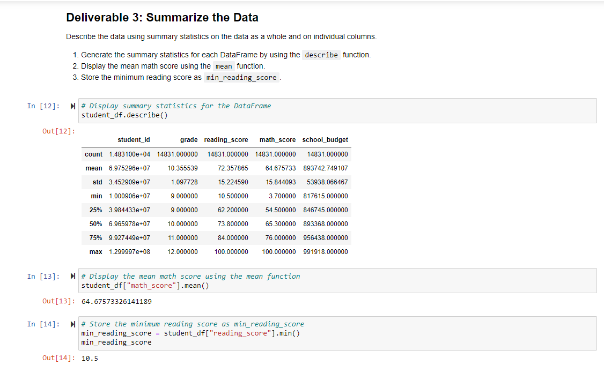

# School_District_Analysis
Analyze standardized test data for a city school district.

## Overview of PyCity Schools Analysis

This project is to assist Maria, a chief data scientist for a city school district, analyze data on student funding and standardized test results. The data is then aggregated to showcase trends in school performance. These insights will then be used to inform discussions and make strategic decisions at the school and district level. 

### Purpose

The purpose is to collect data, prepare the data (after cleaning it) and analyse the data to make informed decisions.

## Summarize Your Findings

1. There were a lot of missing data in the dataset - 1968 reading_scores & 982 math_scores were missing.

2. In addition, 1836 records were duplicate. If these messy data are not cleaned up, they can skew the data analysis.

3. Looking at the summary statistics, it appears that the data is pretty symmetrical. This can be verified by looking at the mean and the median (50%) values of reading score and math score - they are pretty close to each other.

4. The average reading score for grades 11 and 12 combined is higher than the average reading score for all grades.

5. Public schools have a higher budget than Charter schools.

6. The Charter schools have higher average math scores in grades 9 to 11 than Public schools, but public school 12th grade has higher average math score than their counterparts in Charter school.

## Additional analysis -

- A comparison of the school budget for each school type and school could be done.
- Average reading score for each combination of school type and grade could be calculated and compared with the average math score.
